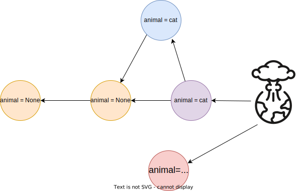

# **Collaborative Programming & Git**

Kilian Lieret

Princeton University

CoDaS-HEP school 2022

Markdown-based slides available as [open source](https://github.com/klieret/collaborative-programming-github)

**Please open these slides on your laptop as we'll jump back and forth between the slides and the browser!**

---

# Structure of this lecture

1. **Exploring github in the browser**
  
   1. Creating issues
   2. Forking a repository
   3. Creating commits
   4. Opening pull requests
   5. Handling merge conflicts

2. **Working with a local repository**

3. **Advanced tips & tricks**

---
layout: two-cols
---

# Let's open an issue!

1. Please navigate to [https://github.com/klieret/codas-hep-22-git-playground](https://github.com/klieret/codas-hep-22-git-playground).
2. Open a issue with a random feature request

::right::

** Bonus tasks **
   
   1. Edit the text & title of your issue
   2. Add a comment mentioning another participant
   3. Use an emoji reaction
   4. Close & reopen your issue
   5. Check for other issues and comment there

---
layout: two-cols
---

# Forking & committing changes

1. Click the **fork** button. This will create a separate *remote* of the repository (think of it as a "copy" of the repo for now).
2. [Optional advanced] First change to a different branch
3. Open the `content` folder and click `Add file` > `Create new file`
4. Call your file `<your name with underscores>_<some random string>` and add a few lines to it

::right::

5. Add a commit message and commit
6. Confirm that you see your file & a new commit
7. Bonus:
   
   1. Add a second file
   2. Open your previous file and make changes to the text

---

# What did we do?

* Every node is a commit
* Your fork "branched off": You're adding additional commits to a parallel reality
* Next step: Brining your commits back to the 

---

# Creating a PR

* We want to apply your changes back to the original repository

---

# Branches

* If we want to work on an additional separate version, we do not need to fork, we can create another branch
* Branches are cheap, go use them!

---

# Forks vs Branches

---

# Merge conflicts

---

# Merge conflicts

Let's create merge conflicts together!

